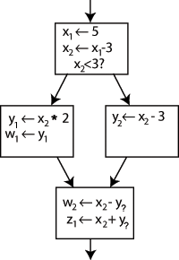

## LLVM

总结了一下LLVM几个头文件中不会用到的一些函数  

#### 0x01 Function

[Function](http://llvm.org/doxygen/Function_8h_source.html)

```C++
const Function &getFunction()
指令数目： getInstructionCount()
函数类型：*getFunctionType()
返回值类型：*getReturnType()
函数名是否包含llvm.：bool isIntrinsic()
是否有关于内存的操作：bool doesNotAccessMemory() 
内存操作是否只发生在参数相关的操作中：bool onlyAccessesArgMemory() 
获取入口基本块：const BasicBlock       &getEntryBlock()
函数BB块列表：const BasicBlockListType &getBasicBlockList() 
符号表：inline const ValueSymbolTable *getValueSymbolTable()

基本块的操作：
   iterator                begin()       { return BasicBlocks.begin(); }
   const_iterator          begin() const { return BasicBlocks.begin(); }
   iterator                end  ()       { return BasicBlocks.end();   }
   const_iterator          end  () const { return BasicBlocks.end();   }
 
   size_t                   size() const { return BasicBlocks.size();  }
   bool                    empty() const { return BasicBlocks.empty(); }
   const BasicBlock       &front() const { return BasicBlocks.front(); }
         BasicBlock       &front()       { return BasicBlocks.front(); }
   const BasicBlock        &back() const { return BasicBlocks.back();  }
         BasicBlock        &back()       { return BasicBlocks.back();  }

显示CFG：void viewCFG() const;
```

#### 0x02 BasicBlock

[BasicBlock](http://llvm.org/doxygen/BasicBlock_8h_source.html)

```c++
const Function *getParent()
const Module *getModule()
结束指令：const Instruction *getTerminator()
第一条非PHI非调试指令：Instruction* getFirstNonPHIOrDbg()
操控基本块：void moveAfter(BasicBlock *MovePos);
void insertInto
得到前任：const BasicBlock *getSinglePredecessor() const;
是否有N个或更多前任：bool hasNPredecessorsOrMore(unsigned N) const;
const BasicBlock *getSingleSuccessor() const;
跳过调试指令：BasicBlock::iterator skipDebugIntrinsics(BasicBlock::iterator It);
 ```

#### 0x03 Instruction

[Instruction](http://llvm.org/doxygen/IR_2Instruction_8h_source.html)

```c++
指令操作码：unsigned getOpcode()
指令操作名称：const char *getOpcodeName()
bool isTerminator()
是否有元数据：bool hasMetadata() const
获取元数据：MDNode *getMetadata(StringRef Kind) 
是否读写内存：bool mayReadOrWriteMemory() const 
```

#### 0x04 Loop

[Loop](http://llvm.org/doxygen/LoopInfo_8h_source.html)

```c++
获取循环深度：unsigned getLoopDepth() const 
获取循环头基本块：BlockT *getHeader()
父循环：LoopT *getParentLoop() 
是否包含某循环：bool contains(const LoopT *L)
获取子循环：const std::vector<LoopT *> &getSubLoops() const {
获取循环包含的基本块：ArrayRef<BlockT *> getBlocks() const {
是否有循环不变量：bool hasLoopInvariantOperands(const Instruction *I) const;
```

#### 0x05 PHINode



底层BB块中的y可以被指定为y1或是y2，因此在最后区块的起始加入称之为Φ(Phi)的函数，y3=Φ(y1, y2)。


